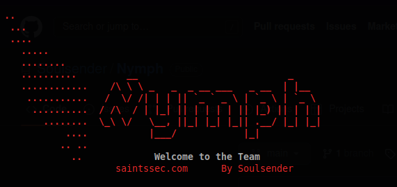
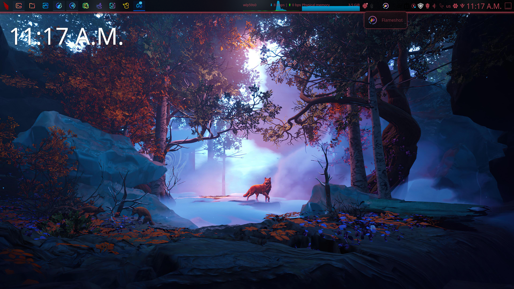

# Nymph

Bash script that will rice, and install various tools in the theme of the [Saints](https://saintssec.com).





**ONLY EXECUTE `main.sh`.** The other files are meant to run off `main.sh`, and are not supposed to be executed manually.

Please see `-h` for available options when installing.

### Important Notes
 - When the installer asks if you would like to use `sddm` or any other option (usually `lightdm` or `gdm`) choose whichever one you like. On ParrotOS, `lightdm` is the default login manager. `sddm` is the default login manager for Plasma. `gdm` is the login manager for Gnome (Ubuntu).
 - When you clone the script, **please use the URL or the link generated by github. DO NOT CLONE BY MANUALLY TYPING OUT.** There is a problem that I will fix sometime in the future where it will clone the repository as `nymph` and NOT `Nymph` which will cause some path issues in the script.
 - Please see the post-installation documentation below after you run the script.

### Installation and Usage
Clone the script via:
```
git clone https://github.com/Soulsender/Nymph
```
change directory and execute:
```
cd Nymph/
sudo chmod +x main.sh
sudo ./main.sh
```
and respond to the prompts that will appear. **See `-h` for options.**

### Post-Install
Plasma isn't very command-line friendly when it comes to automation as something like i3. Follow these steps until I can get a reliable way to automate everything.
 - **STEP 1:** Open the menu with your super key (or windows key), and find Plasma Style. Select `LyraS-dark` from this menu and hit apply. 
 - **STEP 2:** Open the menu again, and find Icons. Select `candy-icons` and hit apply. 
 - **STEP 3:** Right click on the desktop and select configure desktop. The wallpaper will be stored in `/usr/share/backgrounds/wallpapers/saints-name.png`. Add it, and hit apply. 
 - **STEP 4:** Right click on the start menu icon and select Configure Application Launcher. Click on the icon, and use the image in `~/.local/share/plasma/desktoptheme/LyraS-dark/icons/start.svg` to set it to the saints icon. If you are unable to see hidden directories, check the top right of the Dolphin file manager to enable hidden files.
 - **Optional STEP 5:** If you decided to use `sddm` as your login manager, and not the default one that ships with your chosen distro, simply type in Login Screen in the menu, and customize to your liking. Should you decide to go back to your old login manager, open a terminal and run
 ```
 sudo systemctl disable sddm
 ```
 and 
 ```
sudo systemctl enable lightdm
 ```
 where `lightdm` is your chosen login manager (ex. `lightdm`, `gdm3`, `lxdm`).
 - **Optional STEP 6:** Should you want status bars about RAM, CPU, internet speed, or other widgets, right click on the taskbar and click edit panel to go into edit mode. Click add widgets, and type the name of the type of widget you would like to add. Click and drag the widget to the appropriate location, whether on your desktop or taskbar. You may also change the configuration of these widgets, simply by hovering over them in edit mode, and selecting configure. 

### Credit
 - [Template Plasma Theme (LyraS-dark)](https://github.com/yeyushengfan258/LyraS-kde)
 - [Candy Icons](https://store.kde.org/p/1305251)
 - [Saints Icons & wallpapers](https://github.com/itsjustshepherd)
